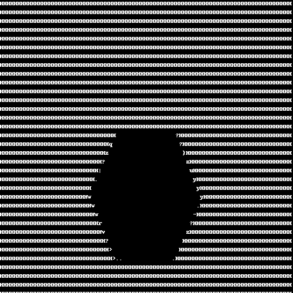

# converting normal gif image to ASCII type gif.

* packages --> requirments.txt
* GIF images which has to convert as to be place in `sample_gif` folder.
* After Successfull code run, all the converted images placed in the `converted` folder with the same name as of originals.

# convertion sample
* Input

* output

